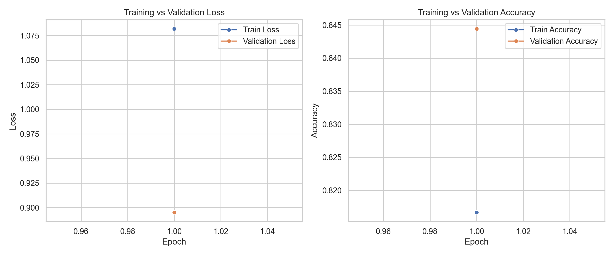

# Sentiment Analysis on Product Reviews using Machine Learning and RoBERTa

## 📖 Description

This project classifies product reviews into **positive**, **neutral**, or **negative** sentiment by analyzing review text with both traditional machine learning models and a transformer-based model. It combines a reproducible preprocessing and training pipeline, saved model artifacts, evaluation reports, and a Streamlit interface for interactive prediction.

Sentiment analysis is a widely used real-world NLP task because customer reviews strongly influence purchase decisions, brand perception, and business strategy. A system like this helps turn raw review text into actionable insight by automatically identifying the underlying sentiment.

## What Is Sentiment Analysis

Sentiment analysis is the process of identifying the emotional tone of text. In Natural Language Processing, this is treated as a text classification problem where the model learns patterns from labeled examples and predicts whether a new review is **positive**, **neutral**, or **negative**.

In this project, sentiment labels are created directly from product ratings:

- `1–2` = Negative
- `3` = Neutral
- `4–5` = Positive

## How It Works

1. The user enters a product review in the app.
2. The review text is cleaned and normalized.
3. The saved RoBERTa model is used as the primary predictor when available.
4. Traditional ML baselines also run on the same text for comparison.
5. The app displays the main prediction, confidence score, class probabilities, and live model comparison.

## 🎯 Objectives

- Classify reviews into negative, neutral, and positive sentiment
- Compare traditional ML models with a transformer-based model
- Build a clean and reproducible NLP pipeline
- Save model artifacts so predictions can be made without retraining
- Provide an interactive interface for real-time sentiment prediction

## 🧠 Technologies Used

- Python
- Scikit-learn
- Pandas
- NumPy
- Matplotlib
- Seaborn
- Streamlit
- Hugging Face Transformers
- PyTorch
- Joblib

## 📂 Dataset Information

- Dataset used: `reviews.csv`
- Main features:
  - `body`
  - `rating`
  - optional metadata such as `title_x`, `brand`, and `verified`
- Label creation rule:
  - `1–2` = Negative
  - `3` = Neutral
  - `4–5` = Positive

The dataset in this repository contains Amazon-style product reviews. The preprocessing pipeline combines review title and review body where available so the model can learn from both short titles and detailed review text.

## Project Structure

```text
Sentiment Analysis on Amazon reviews/
|-- app.py
|-- data/
|   `-- processed/
|-- models/
|-- notebooks/
|-- outputs/
|   |-- figures/
|   `-- reports/
|-- requirements.txt
|-- reviews.csv
`-- src/
    |-- config.py
    |-- eda.py
    |-- evaluate.py
    |-- inference.py
    |-- preprocessing.py
    |-- train_ml.py
    |-- train_roberta.py
    `-- utils.py
```

## Requirements

- Python 3.10 or later
- pip

## ⚙️ Installation & Setup

```bash
git clone https://github.com/LOKESHBOOTU/SENTIMENT-ANALYSIS-ON-AMAZON-REVIEWS.git
cd SENTIMENT-ANALYSIS-ON-AMAZON-REVIEWS
python -m venv .venv
.venv\Scripts\activate
pip install -r requirements.txt
python -m streamlit run app.py
```

If Windows or OneDrive locks files inside `.venv`, you can use the local package-folder fallback:

```powershell
python -m venv .venv
.venv\Scripts\Activate.ps1
python -m pip install --target .python_packages -r requirements.txt
$env:PYTHONPATH = (Resolve-Path .python_packages).Path
python -m streamlit run app.py
```

## 🔍 Methodology / Workflow

1. **Data Collection**  
   The project uses a product review dataset with review text and star ratings.

2. **Label Creation**  
   Ratings are mapped into three sentiment classes:
   - `1–2` → Negative
   - `3` → Neutral
   - `4–5` → Positive

3. **Data Cleaning**  
   Missing values are handled and incomplete rows are removed before training.

4. **Text Preprocessing**  
   Text is lowercased, punctuation is removed, stopwords are filtered, and normalized text is saved for downstream modeling.

5. **Feature Extraction**  
   TF-IDF vectorization is used for machine learning models, while tokenization with `roberta-base` is used for transformer training.

6. **Model Training**  
   Multiple classical ML models are trained and compared, followed by fine-tuning of RoBERTa for sequence classification.

7. **Model Evaluation**  
   Accuracy, precision, recall, F1-score, confusion matrices, and comparison charts are used to measure performance.

8. **Prediction**  
   Saved model artifacts are loaded by the Streamlit app, so the system can make predictions without retraining every time.

## 🤖 Models Used

### Traditional Machine Learning Models

- Logistic Regression
- Naive Bayes
- Support Vector Machine (SVM)

### Transformer Model

- RoBERTa (`roberta-base`)

RoBERTa is used as the **primary prediction model** when the saved transformer artifact is available locally, while the ML models are displayed alongside it for comparison.

## 📊 Results / Accuracy

Latest saved model metrics from the held-out evaluation run:

| Model | Accuracy | Precision | Recall | F1-score |
| --- | ---: | ---: | ---: | ---: |
| Logistic Regression | 0.8792 | 0.8945 | 0.8792 | 0.8857 |
| Naive Bayes | 0.8784 | 0.8809 | 0.8784 | 0.8597 |
| SVM | 0.8966 | 0.8921 | 0.8966 | 0.8937 |
| RoBERTa | 0.8867 | 0.8670 | 0.8867 | 0.8742 |

**Best-performing classical model:** SVM  
**Main app model:** RoBERTa when available locally

## 📸 Screenshots / Output

The project includes a Streamlit interface for entering product reviews, viewing predictions, confidence scores, class probabilities, and live comparison across saved models.

### Main Interface

The app accepts a review and predicts sentiment instantly using saved model artifacts.

### Live Model Comparison

The interface compares the RoBERTa prediction with the traditional ML models so users can see how different approaches respond to the same review.

### Training And Validation Curves

The project also saves RoBERTa training history, including epoch-wise training and validation loss and accuracy curves for analysis and reporting.



## 🚀 Features

- Detect sentiment instantly from review text
- Compare ML models and RoBERTa on the same input
- Interactive web interface for prediction
- Saved trained artifacts so the app does not retrain on every run
- EDA plots, confusion matrices, and comparison reports
- Training and validation loss/accuracy curves for RoBERTa
- Deployment-ready project structure for local demos and portfolio presentation

## Applications

- Understanding customer feedback at scale
- Monitoring sentiment for e-commerce products
- Demonstrating NLP text classification in academic projects
- Comparing classical ML and transformer approaches on review data
- Building portfolio-ready machine learning web apps

## Why This Project Is Useful

- Helps users understand how sentiment classification works in practice
- Saves time by giving quick insight from large volumes of reviews
- Shows a complete workflow from preprocessing to training to deployment
- Useful for students, researchers, and beginners learning NLP and ML deployment

## ⚠️ Limitations

- Performance depends heavily on dataset quality and label assumptions
- The current RoBERTa benchmark was constrained by local hardware and deployment practicality
- The model may struggle with sarcasm, mixed sentiment, or unseen review styles
- It is a text classifier, not a complete customer-intelligence system
- The deployed lightweight demo may rely on saved ML models when large RoBERTa weights are not hosted remotely

## 🔮 Future Improvements

- Add hosted transformer weights so the live cloud demo can use RoBERTa directly
- Extend comparison with more models such as XGBoost or DistilBERT
- Add SHAP or LIME explanations for interpretability
- Improve UI polish and deployment automation
- Add automated retraining and experiment tracking

## 👨‍💻 Author / Contributors

- **Lokesh Bootu**
- GitHub: [LOKESHBOOTU](https://github.com/LOKESHBOOTU)

## 📄 License

No license file has been added yet.

If you want to open-source this project properly, adding an **MIT License** would be a good next step.

## Deployment

This project can be run locally using the saved model artifacts and is structured to support lightweight Streamlit deployment. The ML artifacts are small enough for simple demo hosting, while RoBERTa can be used as the main model in local environments where its saved weights are available.
